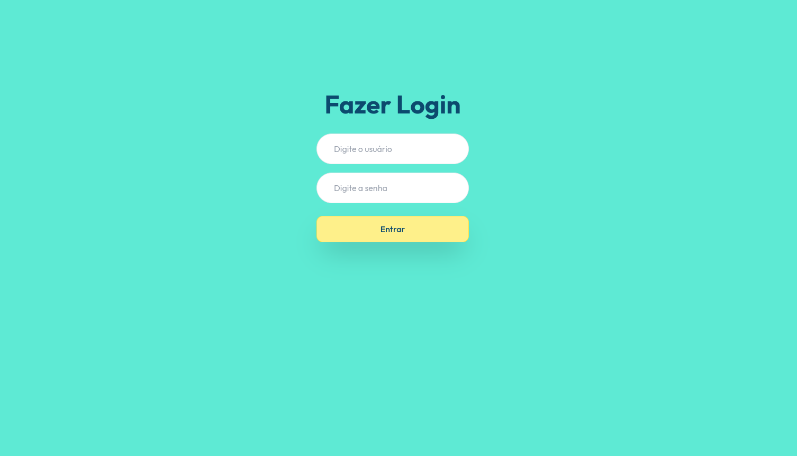

<div align="center">

</div>

<div align="center">

# dot-cecilia

</div>


### <div align="center"> Aplicação em Reactjs/Typescript, abordando conceitos sobre: </div>

- [TypeScript](https://www.typescriptlang.org/) - Tipagens avançadas
- [HeadlessUI](https://headlessui.com/) - UI para tailwind
- [ViteJs](https://vitejs.dev/) - Bundler para gerenciar a aplicação
- [Formik](https://formik.org/docs/overview/) - Manipulação de formulário
- [TailwindCSS](https://tailwindcss.com/) - framework Css declarativo

## <div align="center">Requisitos</div>

Para executar a aplicação é necessário instalar algumas ferramentas tais como um editor de códigos para realizar compilação dos mesmos. Nesse projeto foi utilizado o [Visual Studio Code](https://code.visualstudio.com/), [NodeJS](https://nodejs.org/en/) para compilação do código, [Git Bash](https://gitforwindows.org/) para baixar o repositório e baixar todas as dependências necessárias.

```bash
# Clone este repositório(caso ja tenha feito isso no passo anterior, pule para o próximo comando)
$ git clone <https://github.com/Ricnaga/dotcecilia>

# Acesse a pasta do projeto no terminal/cmd
$ cd dotcecilia

# Instale as dependências
$ yarn (ou npm -i)

# Inicie a aplicação no lado do backend
$ yarn dev (ou npm run dev)

# A aplicação abrirá automaticamente um navegador com o endereço <http://localhost:3000>
```

#

## <div align="center">Demonstração</div>

### <div align="center"> [https://dotcecilia.netlify.app](https://dotcecilia.netlify.app/)</div>
